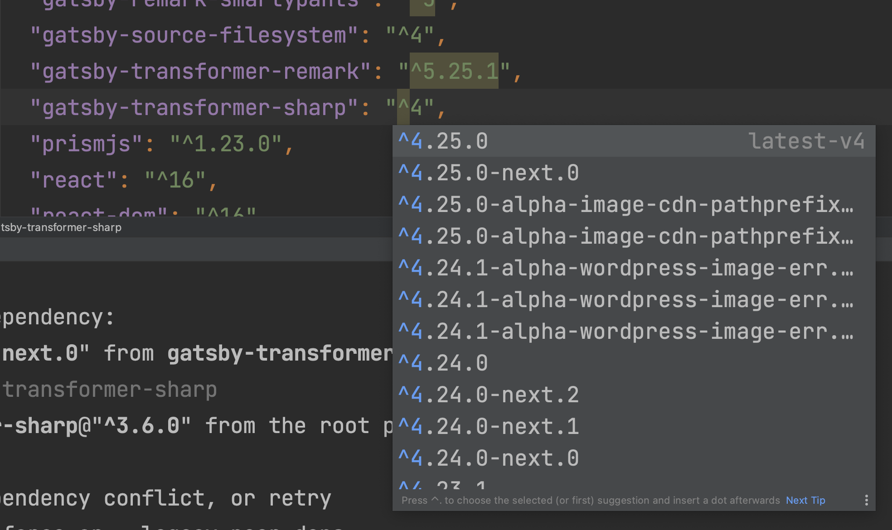
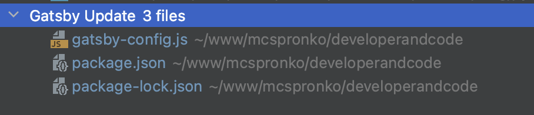
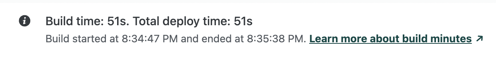
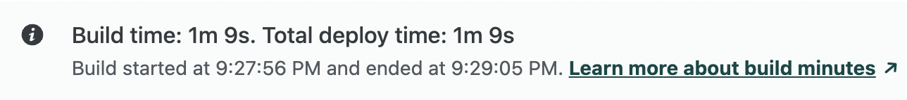

Чудовий ранок неділі, який я вирішив присвятити оновленню сайту Developer & Code.
Цей проєкт був зроблений на Gatsby версії 3. З того часу пройшло декілька років, та на разі актуальна версія Gatsby є 5.

Чому б не оновитися, подумав я, та поділитись у цьому дописі.

## Документація

В документації по міграції Gatsby написано, що якщо у вас версія 3, то спочатку необхідно оновитись до останньої версії 3. Потім оновитися до версії Gatsby 4, та запустити `gatsby build`.
Ця команда дасть змогу переглянути всі помилки в терміналі, та вирішити їх, перед оновленням на версію Gatsby 5.

Але все пішло не за планом.

## Процес Оновлення

В першу чергу, необхідно оновити всі версії бібліотек до останньої можливої версії 3.х.х. Для цього необхідно запустити команду `npm outdated` в директорії проєкту.

В результаті виконання `npm outdated`, можна переглянути список всіх залежностей.

```bash
Package                          Current   Wanted  Latest  Location                                      Depended by
gatsby                            3.15.0   3.15.0  5.13.3  node_modules/gatsby                           developerandcode
gatsby-plugin-feed                3.15.0   3.15.0  5.13.1  node_modules/gatsby-plugin-feed               developerandcode
gatsby-plugin-gatsby-cloud        2.11.0   2.11.0  5.13.1  node_modules/gatsby-plugin-gatsby-cloud       developerandcode
gatsby-plugin-google-analytics    3.15.0   3.15.0  5.13.1  node_modules/gatsby-plugin-google-analytics   developerandcode
gatsby-plugin-google-gtag         3.15.0   3.15.0  5.13.1  node_modules/gatsby-plugin-google-gtag        developerandcode
gatsby-plugin-image               1.15.0   1.15.0  3.13.1  node_modules/gatsby-plugin-image              developerandcode
gatsby-plugin-manifest            3.15.0   3.15.0  5.13.1  node_modules/gatsby-plugin-manifest           developerandcode
gatsby-plugin-offline             4.15.0   4.15.0  6.13.1  node_modules/gatsby-plugin-offline            developerandcode
gatsby-plugin-react-helmet        4.15.0   4.15.0  6.13.1  node_modules/gatsby-plugin-react-helmet       developerandcode
gatsby-plugin-sharp               3.15.0   3.15.0  5.13.1  node_modules/gatsby-plugin-sharp              developerandcode
gatsby-plugin-sitemap             4.11.0   4.11.0  6.13.1  node_modules/gatsby-plugin-sitemap            developerandcode
gatsby-remark-copy-linked-files    3.2.0    3.2.0  6.13.1  node_modules/gatsby-remark-copy-linked-files  developerandcode
gatsby-remark-images               4.2.0    4.2.0  7.13.1  node_modules/gatsby-remark-images             developerandcode
gatsby-remark-prismjs              4.2.0    4.2.0  7.13.1  node_modules/gatsby-remark-prismjs            developerandcode
gatsby-remark-responsive-iframe    3.2.0    3.2.0  6.13.1  node_modules/gatsby-remark-responsive-iframe  developerandcode
gatsby-remark-smartypants          3.2.0    3.2.0  6.13.1  node_modules/gatsby-remark-smartypants        developerandcode
gatsby-source-filesystem          3.15.0   3.15.0  5.13.1  node_modules/gatsby-source-filesystem         developerandcode
gatsby-transformer-remark          3.2.0    3.2.0  6.13.1  node_modules/gatsby-transformer-remark        developerandcode
gatsby-transformer-sharp          3.15.0   3.15.0  5.13.1  node_modules/gatsby-transformer-sharp         developerandcode
prettier                           2.2.1    2.2.1   3.2.5  node_modules/prettier                         developerandcode
react                            16.14.0  16.14.0  18.2.0  node_modules/react                            developerandcode
react-dom                        16.14.0  16.14.0  18.2.0  node_modules/react-dom                        developerandcode
typeface-merriweather             0.0.72   0.0.72  1.1.13  node_modules/typeface-merriweather            developerandcode
typeface-montserrat               0.0.75   0.0.75  1.1.13  node_modules/typeface-montserrat              developerandcode
```

Якщо у вас як у мене, версія пакету Current така сама як версія, зазначена в колонці Wanted, переходимо до оновлення `gatsby`.

Оновлюємо версію Gatsby до версії 4.
Запускаємо команду `npm install`.

```bash
npm install gatsby@4
```

У процесі розв'язання питань з різними версіями сторонніх бібліотек та помилок в терміналі, я вирішив оновлюватись одразу до останньої версії Gatsby 5.

Очевидно, якщо проєкт великий, і багато функціоналу, то необхідно розв'язувати питання поступово. Але в моєму випадку, я дозволив собі перейти одразу на 5 версію.

Тому, я відкрив файл `packages.json` та пройшовся по всім версіям, та оновив їх до останньої можливої.

PHPStorm IDE редактор, у цьому випадку, показав мені останню версію кожного пакету, і мені не треба було бігати інтернетом та шукати відповіді.



Після цього, я запустив команду `npm run build` та отримав ось таку помилку.

```bash
 ERROR #11331  PLUGIN

Invalid plugin options for "gatsby-plugin-feed":

- "feeds" is required
```

Як виявилось, це була оновлена конфігурація пакета `gatsby-plugin-feed`. Хоча я хибно думав що це додаткова залежність, яку я маю встановити.

Але завдяки документації для пакета `gatsby-plugin-feed`, додатково необхідно додати опцію `feeds`.

У файлі `gatsby-config.js` необхідно додати конфігурацію для `feeds`. 

```javascript
module.exports = {
  plugins: [
    // ... інші плагіни
    {
      resolve: `gatsby-plugin-feed`,
      options: {
        feeds: [
          {
            serialize: ({ query: { site, allMarkdownRemark } }) => {
              return allMarkdownRemark.nodes.map(node => {
                return Object.assign({}, node.frontmatter, {
                  description: node.excerpt,
                  date: node.frontmatter.date,
                  url: site.siteMetadata.siteUrl + node.fields.slug,
                  guid: site.siteMetadata.siteUrl + node.fields.slug,
                  custom_elements: [{ "content:encoded": node.html }],
                })
              })
            },
            query: `
              {
                allMarkdownRemark(
                  sort: { order: DESC, fields: [frontmatter___date] },
                ) {
                  nodes {
                    excerpt
                    html
                    fields {
                      slug
                    }
                    frontmatter {
                      title
                      date
                    }
                  }
                }
              }
            `,
            output: "/rss.xml",
            title: "Developer & Code RSS Feed",
          },
        ],
      }
    }
  ]
}

```

Ще раз перезапускаємо команду `npm outdated`. І, як бачимо, тільки 1 пакет залишився, який знаходиться у секції `devDependencies` файлу `packages.json`.

```bash
maxpronko@MAXS-MBP developerandcode % npm outdated
Package   Current  Wanted  Latest  Location               Depended by
prettier    2.2.1   2.2.1   3.2.5  node_modules/prettier  developerandcode
```

Запускаємо оновлення пакету `prettier` та отримуємо останню версію.
```bash
npm install prettier@3.2.5 --dev
```

Таким чином, все, що оновилось з версії Gatsby 3 до 5 це 3 файли.



## Висновки

Таким чином, я оновив Gatsby проєкт з версії 3 на 5. Також оновив всі бібліотеки, які використовуються в проєкті.
Для оновлення у вашому проєкті, раджу ознайомитись з документацією по міграції Gatsby з 3 на 4, та Gatsby 4 на 5. 

Я переконаний, що у вас ситуація може бути складнішою, тому важливо покроково змінювати систему та перевіряти, чи все працює. Бажано мати на проєкті [автоматизовані тести](/maxpronko/test-driven-development-book), які допоможуть швидше перевірити систему.

## Швидкодія Розгортання Сайту

Цікавим моментом в документації я помітив, що перехід з Gatsby 3 на Gatsby 4 дає до 40% покращення часу розгортання сайту.

Сайт на Gatsby 5, і чомусь я покращення не помітив.

Ось приклад розгортання на Gatsby 3.



Як ми можемо побачити, Netlify необхідно було 51 секунду.

Та після оновлення на Gatsby 5.



Netlify необхідно 69 секунд. Можливо, я десь упустив якесь налаштування, яке дозволить реально побачити покращення в 40%.

[Підписуйтеся на канал "Спільнота програмістів - Developer & Code" в телеграмі](https://t.me/developerandcode)
