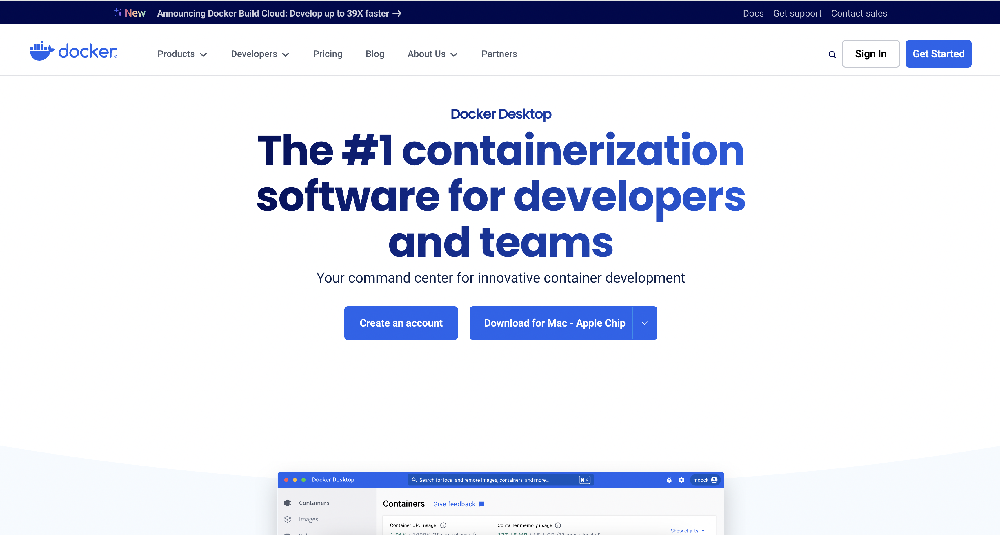
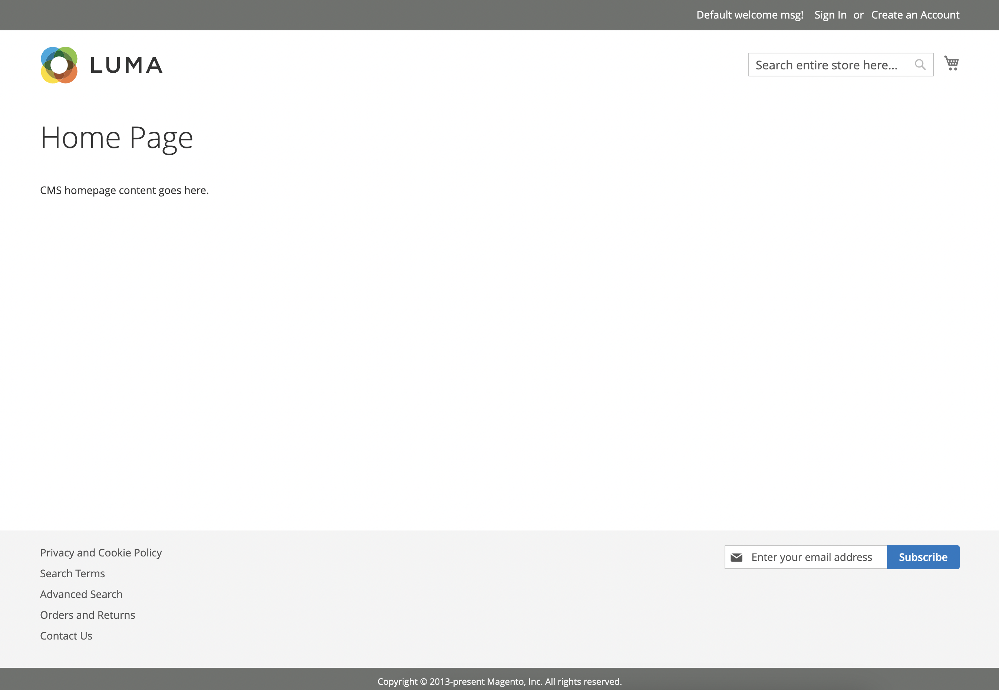
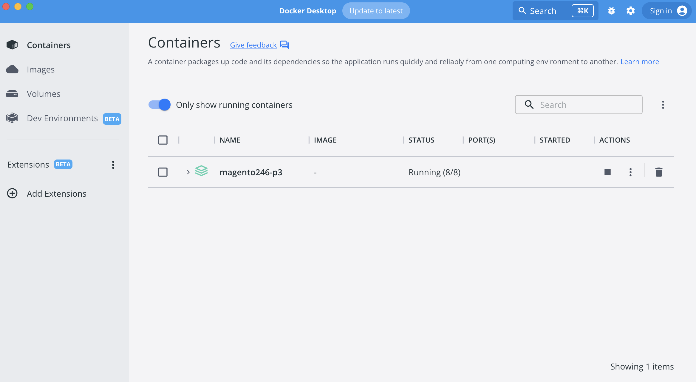
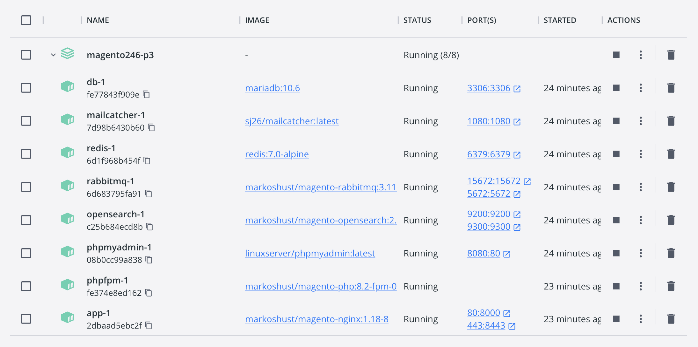

## Що необхідно для початку?

Перш за все, необхідно встановити Docker Desktop. Також нам необхідно встановити Homebrew, для того, щоб через Homebrew встановити curl. 

Уважно: Homebrew необхідний тільки для користувачів Macos та Linux. Якщо у вас Windows, то можете пропустити Homebrew секцію та перейти до Docker Desktop.

### Homebrew

Homebrew використовується для систем Macos та Linux для встановлення додаткових бібліотек. З Homebrew також встановлюються різні версії PHP, MySQL, Mariadb та інше.
Я буду використовувати Homebrew для того, щоб встановити curl бібліотеки.

Для встановлення Homebrew, необхідно запустити наступну команду в терміналі:

```bash
/bin/bash -c "$(curl -fsSL https://raw.githubusercontent.com/Homebrew/install/HEAD/install.sh)"
```
Також, можна більш детально ознайомитись з можливостями Homebrew на сайті [brew.sh](https://brew.sh/).

У терміналі, після успішного встановлення, я можу побачити результат запуску команди brew:

```bash
brew commands
```

За допомогою команди commands, можна ознайомитись з списком усіх доступних команд:

```bash
maxpronko@MAXS-MBP ~ % brew commands
==> Built-in commands
--cache                         completions                     info                            postgresql-upgrade-database     unlink
--caskroom                      config                          install                         postinstall                     unpin
--cellar                        deps                            leaves                          pyenv-sync                      untap
--env                           desc                            link                            rbenv-sync                      update-report
--prefix                        developer                       list                            readall                         update-reset
--repository                    docs                            log                             reinstall                       update
--version                       doctor                          migrate                         search                          upgrade
analytics                       fetch                           missing                         setup-ruby                      uses
autoremove                      formulae                        nodenv-sync                     shellenv                        vendor-install
casks                           gist-logs                       options                         tap-info
cleanup                         help                            outdated                        tap
commands                        home                            pin                             uninstall

==> Built-in developer commands
audit                      command                    generate-cask-api          pr-publish                 style                      update-maintainers
bottle                     contributions              generate-formula-api       pr-pull                    tap-new                    update-python-resources
bump-cask-pr               create                     generate-man-completions   pr-upload                  test                       update-sponsors
bump-formula-pr            determine-test-runners     install-bundler-gems       prof                       tests                      update-test
bump-revision              dispatch-build-bottle      irb                        release                    typecheck                  vendor-gems
bump-unversioned-casks     edit                       linkage                    rubocop                    unbottled
bump                       extract                    livecheck                  ruby                       unpack
cat                        formula                    pr-automerge               sh                         update-license-data

==> External commands
services
```

### curl

Після успішного встановлення Homebrew, необхідно встановити curl. Для цього, в терміналі запускаю команду:

```bash
brew install curl
```

Також, необхідно запустити команду, для того, щоб мати можливість запускати brew curl у терміналі. 

```bash
echo 'export PATH="$(brew --prefix)/opt/curl/bin:$PATH"' >> ~/.zshrc
source ~/.zshrc
```

### Docker Desktop

Перш за все, я встановив Docker Desktop. Я розумію, що зараз на ринку є багато альтернатив, і пропозицій безкоштовних для локального підйому Docker контейнерів. Але для мене наразі працює Docker Desktop. Якщо перестане працювати, буду переходити на щось швидше.

[Docker Desktop](https://www.docker.com/products/docker-desktop/) можна скачати з сайту docker.com.




## Встановлення Magento Open Source

Заходжу в директорію з проєктами, які запускаються за допомогою Docker. 
```bash
cd ~/www/docker/
```

Далі, необхідно створити нову директорію, в якій буде створений новий проєкт Magento Open Source разом з Docker файлами.

Наприклад, якщо я хочу запустити Magento Open Source версію 2.4.6-p3, то назва директорії буде відповідати версії.
```bash
mkdir magento246-p3
```

У випадку ж з клієнтськими проєктами, назва директорії буде назвою домену сайту. Наприклад, якщо домен клієнта www.developerandcode.com, то директорія буде називатись developerandcode. Це зручно тому, що назва директорії слугує як ідентифікатор проєкту, а не точною назвою реального домену. Все одно, локально домен скоріш за все буде developerandcode.test. 

Переходжу в директорію, яку тільки що створив використовуючи команду cd:
```bash
cd $_
```

Запускаю команду, яка завантажить усі необхідні файли та запустить скрипт, який встановить Magento Open Source. 
```bash
curl -s https://raw.githubusercontent.com/markshust/docker-magento/master/lib/onelinesetup | bash -s -- magento.test 2.4.6-p3 community
```

Вкінці вищезгаданої команди є параметри, які впливають на версію Magento (2.4.6-p3), назву локального домену (magento.test), та тип community, який говорить про те, що ми встановлюємо саме Open Source версію.

```bash
bash -s -- magento.test 2.4.6-p3 community
```

Ці параметри можна змінювати, якщо необхідно інша версія, або домен.

При встановленні SSL сертифікату, скрипт може попросити ввести пароль адміністратора. 

```bash
Generating SSL certificate...
cat: can't open '/root/.local/share/mkcert/rootCA.pem': No such file or directory
Created a new local CA 💥
The local CA is now installed in the system trust store! ⚡️

System password requested to install certificate authority on host...
Password:
```

Після закінчення процесу встановлення, у консолі має написати наступні рядки:

```bash
Enabled developer mode.
Docker development environment setup complete.
You may now access your Magento instance at https://magento.test/
```

Це означає, наступне:
1. Magento Open Source проєкт успішно встановлений
2. Magento Mode включений в режим розробки (developer)
3. Локальний домен налаштований як https://magento.test/ і я можу через браузер побачити сайт.



Після успішного запуску вищезгаданої команди, в Docker Desktop можна побачити активну директорію magento246-p3.



Якщо відкрити директорію, то можна побачити усі запущені контейнери, які необхідні для роботи Magento Open Source.



## Sample Data

Зазвичай, я також встановлюю додатково тестові дані, з якими можна працювати при розробці функціоналу Magento локально. Для цього я запускаю наступну команду в терміналі.

Важливо бути в директорії, яку я створив першочергово `~/www/docker/magento246-p3`.

```bash
bin/magento sampledata:deploy
```

Та команда для інсталяції тестових даних в базу даних:

```bash
bin/magento setup:upgrade
```

Якщо відкрити браузер, або перезапустити вкладку, де я першочергово відкрив проєкт https://magento.test/, то можна побачити оновлену версію домашньої сторінки разом з тестовими даними.


## Висновки

Таким чином, у цьому дописі я поділився своїм процесом встановлення Magento Open Source за допомогою Docker. Я також показав, які додаткові бібліотеки необхідні для успішного налаштування локального середовища. Наступний крок, це відкрити PHPStorm та почати писати Magento 2 модулі. 

До речі, якщо цікаво навчитись розроблювати для платформи Magento, у мене є безліч відео на [YouTube каналі](https://www.youtube.com/@PronkoMax/videos), де я викладаю уроки для розробників. 

[Підписуйтеся на канал "Спільнота програмістів - Developer & Code" в телеграмі](https://t.me/developerandcode)
