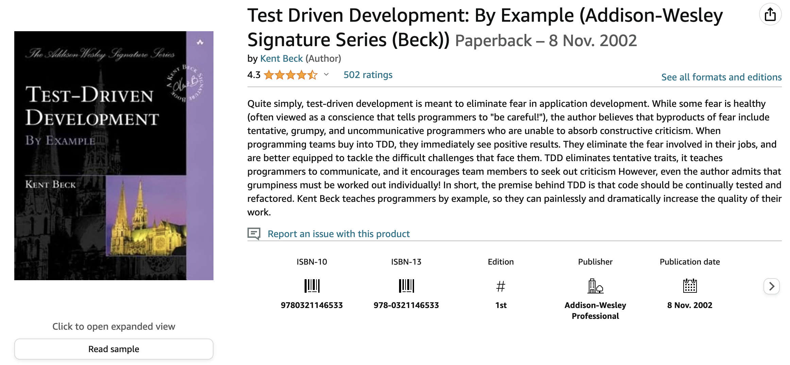

## Вступ

Розуміння підходу написання тесту перед створенням першого рядку коду у мене було. 
Я використовував цей метод час від часу на комерційних та власних проєктів. Також, у свій час написав декілька розгорнутих статей на тему Test Driven Development.

Легше за все, мені зручно слідувати принципу Test Driven Development тоді, коли я починаю новий проєкт. У проєкт майже немає залежностей, та код, власноруч написаний, виглядає чистіше та зрозуміліше.

Інша справа, коли необхідно написати код в рамках реального проєкту, або як частина фреймворку, де 80% написаного тобою коду визначено правилами самого фреймворку. 
У такому випадку, важче навіть уявити, як почати написання тесту перед будь-яким уявленням, який код і де писати, щоб був хоч якийсь результат. 

Книга Test Driven Development by Example автора Кент Бек (Kent Beck) зацікавила мене як така, що дасть мені змогу краще зрозуміти підхід написання тестів разом з кодом. 
Кент Бек написав декілька інших книжок, які я читав, і пам'ятаю, вони мені зайшли та розвинули мене як програміста.

Тому, побачивши цю книгу на сайті Amazon, та не довго думаючи, я вирішив замовити її для прочитання.

Однак, я вже почав читати декілька інших книжок. Одна з книг, яку я читав була The DevOps Handbook, яка дає розуміння, що адміністрування релізів, їх автоматизація, та розробка функціональності програмних продуктів мають йти пліч-о-пліч. 

А друга книга, Python Crash Course, за основу якої я вирішив вивчити мову програмування Python у цьому році та покращити свої навички у програмуванні.  

## Про Книгу

Після прочитання перших декількох сторінок книги Test Driven Development by Example, я зрозумів, що вона мені однозначно сподобається.

У чому суть книги.

З перших сторінок книги, з першого ж розділу, автор дає приклад розробки функціоналу програмного продукту WyCash. 
Вступ до книги ніби підводить до ідеї написання тестів. У випадку, коли замовник хоче отримати відповідь на питання, чи буде готова нова фіча за декілька днів, і нам, як програмістам необхідно відповісти швидко, впевнено, та бажано "так". 

У голові може бути важко навіть уявити всі місця, та варіації бізнес-логіки. Тому, звичайно ж, і відповідь впевнено важко дати.

Згадайте самі, коли останній раз ви давали оцінку задачі, при цьому не маючи тестів, і уявлення скільки необхідно всього протестувати?

А якщо і маєте уявлення, скільки коду написати, то хто дасть гарантії, що новий код не зламає теперішню логіку програмного продукту?

Інша справа, коли код покритий автоматичними тестами. Питання "чи буде працювати нова фіча?" зводиться до того, що "а які тести необхідно написати, щоб отримати бажаний, мінімальний результат". 

Програмісту легше відповісти на питання про додавання або зміни нового функціоналу, якщо при цьому є достатньо кількість автоматичних тестів. Ці тести, мають одразу сказати, де і що поламалась.

А з підходом "red/green/refactor", або 
1. Напиши тест
2. Запусти та отримай негативний результат
3. Напиши або перепиши код, щоб тест пройшов

Можна мати впевненість у тому, що новий код буде працювати, та старий не зламається. 

Цікаво для мене було читати про створення фреймворку для тестування на основі тестів. У другій частині книги Test Driven Development by Example, автор показує, як можна почати писати свій фреймворк для тестування, при тому покриваючи це тестами.
Mind-blowing, якщо ви мене запитаєте. 

У першій частині книги, Кент використовував усіма заїжджену мову програмування Java, але от у другій та третій частинах - Python. І для мене це було прям варенням з молоком, побачивши, що хоч у якійсь частині книги відсутні Java/Smalltack прикладів коду.

Написання тестів для тестового фреймворку також виявився цікавим. Автор, пише, що старається писати свій тестовий фреймворк для кожної нової мови, які він, автор, починає вивчає. Це дає змогу краще та швидше розібратися з новою мовою програмування.

На цьому книга про написання тестів закінчилась, якби не третя частина, в якій автор дає вичерпний список патернів та підходів, які можуть знадобитись при написанні тестів, та рефакторингу коду.

### Що сподобалось

Книга Test Driven Development by Example читається дуже легко, на одному диханні. Книгу можна прочитати за вихідні, або за один день, якщо у вас такий є.
З моєї точки зору, приклади підібрані для книги влучно. Вони чудово розкривають суть та причини написання тестів.

Що цікаво, автор пише, що ви самі можете обирати, як часто та як дрібно писати тести. Головне, пише автор, якщо ви відчуваєте впевненість, що код працює, то тести не обов'язково робити дрібними.
Але, якщо функціональність взагалі не зрозуміла, то легше мати маленький тест, який відповідає на маленьке питання.

### Чи рекомендую я книгу для прочитання

Ця книга підійде тим, хто хоче зрозуміти, як писати тести перед створенням коду. Цікаво, що маючи більше ніж 15 річний досвід розробником, я все одно знайшов у цій книзі щось нове для себе.

Найкраще, цю книгу я рекомендую новачкам. Якщо у вас вже є досвід, то навряд чи ви дізнаєтесь щось нове, але якщо не читали, то можна було б хоч одним оком зазирнути.

Навряд чи ця книга підійде, як подарунок, тому що програміст може образитись, що у нього не якісний код :). 

Та я дуже сумніваюсь, що таку книгу хтось буде тримати у своїй власній бібліотеці. Скоріш за все, це буде книжка бібліотеки у компанії, де ви можете прийти, та за пару вечорів прочитати. А вже разом зі співробітниками обговорювати книгу та практики за чашечкою кави вранці.

[Підписуйтеся на канал "Спільнота програмістів - Developer & Code" в телеграмі](https://t.me/developerandcode)
