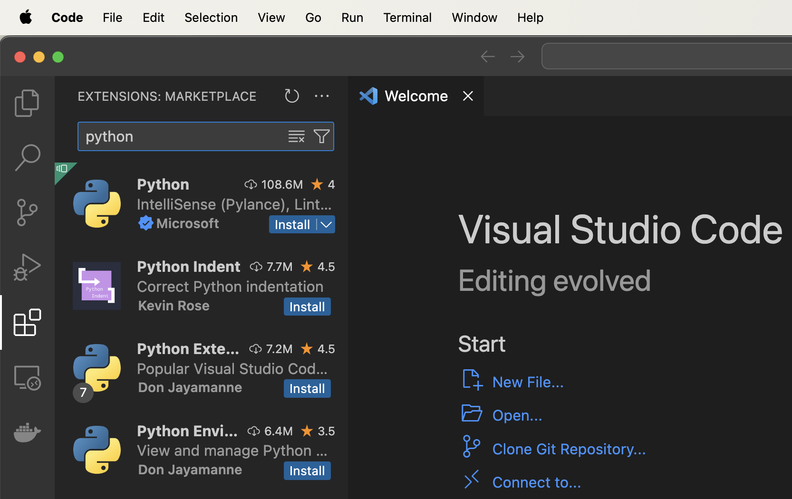

Давненько у мене було таке бажання вивчати щось нове в розрізі програмування. А особливо якщо це мова програмування. В 2024 заходимо впевнено з новими цілями на вивчення Python.

У цьому розділі статей, я хочу ділитися новими знаннями та навичками у сфері роботи з мовою програмування Python.
Та кращого місця, ніж мій рідний україномовний сайт Developer And Code я звичайно ж не знайшов. Кому ще можуть бути цікаві думки, як не моєму сайті.

Тому. Після 15 років з PHP та JavaScript, я вирішив поринутися y щось нове, а саме Python. І звичайно ж, хочу ділитися новим з вами.

**Але Максе, що ж з твоїм YouTube каналом де ти розповідаєш про Magento 2?**

Як кажуть англійською в перекладі на українську: я радий що ви запитали :). По-перше, україномовний канал ожив і я повернувся його вести. 
Там вже є нові відео про Magento 2 українською мовою. І далі буде ще більше.

Я досі працюю з Magento 2, і планую викладати новий матеріал, відео та курси для Magento 2 розробників.

**А що на цьому сайті буде за контент?**

Я точно знаю, що на Developer And Code буде україномовний контент про веб-розробку. Можливо ще щось, що мені буде цікаво поділитися зі світом.

## Отже, Python
Мені стала цікава тема вивчення мови програмування Python через декілька причин.
1. Декілька років дивився на Python і думав, коли ж я почну вивчати.
2. Готував відео по книжці, яку я нещодавно придбав (про книжку згодом), і побачив, що Python вже який рік поспіль на першому місці за популярністю серед інших мов.
3. Цікава тема Штучного Інтелекту, не те щоб дуже, але хочу розібратися.
4. Побачив YouTube канал одного програміста, який довго писав на PHP, і тут вирішив в 2024 році почати Machine Learning вивчення з Python

Я й подумав, що пора.

Захожу на Амазон, вибрати книжку Python. Знайшов одну з найпопулярніших - Python Crash Course, автор Eric Matthes.
Замовив і отримав, вже почав читати.

Ділюся і з вами тим, що я дізнався та пробував нового.

### Де взяти Python?

Необхідно зайти на [офіційний сайт](https://www.python.org/), та скачати дистрибутив.


Незалежно від того, ви на MacOS/Linux або Windows, Python встановлюється без проблем.

### Редактор коду

Можна використовувати VS Code як безкоштовний редактор від Microsoft. 
Або PyCharm від JetBrains, але він буде платним.

Єдине, що для VS Code необхідно встановити `python` плагін. Встановлюємо перший в списку від Microsoft.



### Перший Python скрипт

Створюємо нову папку, наприклад `python_projects` в директорії `Desktop`. Можете локацію вибрати де завгодно.

```bash
cd ~/Desktop/
mkdir python_projects
cd python_projects
```

Додаємо файл `hello_python.py` з кодом.

```python
message = "Hello, Python"
print(message)
```
Зберігаємо файл.

Відкриваємо Terminal через VS Code.


Запускаємо наше програмне забезпечення (новий файл, який тільки що створили).

```bash
python3 hello_python.py
```

Отримуємо результат в тому ж терміналі.


Перший крок зроблено. Далі ми маємо чудовий фундамент для вивчення мови програмування Python.

## Робимо Висновки

У цьому пості, ми розібралися з вами як і де скачувати Python інтерпретатор з офіційного сайту, вибрали редактор коду та встановили `python` плагін для підсвітки коду в редакторі. Ми навіть створили першу програму з використанням Python.

Що ще можна додати? Пропоную разом вивчати та розбиратися як працювати з Python.

[Підписуйтеся на канал Спільнота програмістів - Developer & Code в телеграмі](https://t.me/developerandcode)
